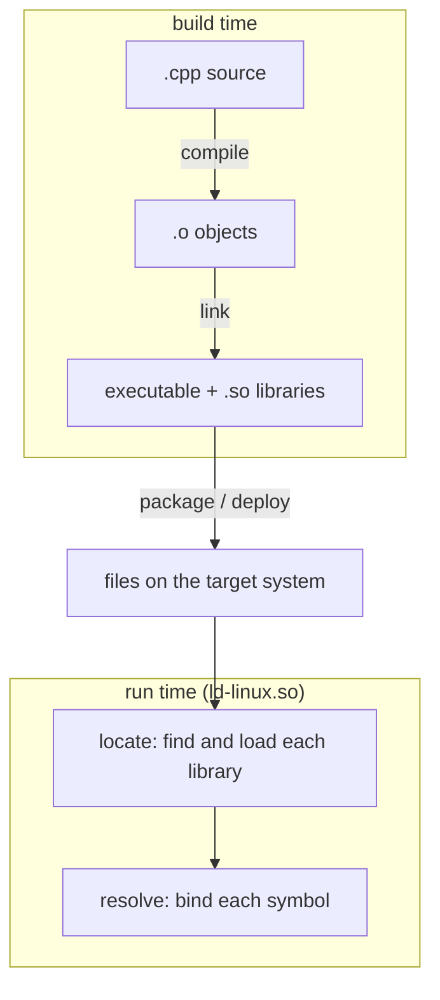

# What is dynamic linking, and how do I troubleshoot it?

The goal is to provide troubleshooting tools for when dynamic linking goes wrong, covering which
tool do you reach for, and what is it actually telling you?

We will not cover the _mechanics_ of dynamic linking (the GOT, PLT, or how to write a shared library
from scratch). Instead we will focus on how to troubleshoot dynamic libraries at different phases of
the dynamic linking process.

# What is dynamic linking?

One of the fundamental aspects of software engineering is code re-use; defining libraries of code
that can be shared, and then combining and composing those building blocks into new libraries and
applications. In general, there are two ways we can **link** a library:

* **Static linking** merges the library into your executable at build time
* **Dynamic linking** resolves library calls at runtime, enabling library re-use without duplicating
  the library for each consumer

This document is about equipping the reader with troubleshooting tools to help them understand
common issues that arise when using dynamic linking.

# The dynamic linking lifecycle

A library passes through several phases on its way from source to a running process. Different
phases have different troubleshooting tools and failure modes, so it's useful to identify what stage
in the lifecycle you're experiencing an issue in.



# Meet the example

Our running example is a three-link chain: an executable that calls a function in one library, which
in turn calls a function in another.


```cpp
// concat.hpp
#pragma once
#include <string>

std::string concat(const std::string& a, const std::string& b);
```

```cpp
// concat.cpp
#include "concat.hpp"

std::string concat(const std::string& a, const std::string& b) {
    return a + b;
}
```

```cpp
// greet.hpp
#pragma once
#include <string>

void greet(const std::string& name);
```

```cpp
// greet.cpp
#include "greet.hpp"
#include "concat.hpp"

#include <iostream>

void greet(const std::string& name) {
    std::cout << concat("hello, ", name) << '\n';
}
```

```cpp
// main.cpp
#include "greet.hpp"

#include <iostream>

int main() {
    std::string name;
    for (;;) {
        std::cout << "> ";
        if (!std::getline(std::cin, name) || name.empty()) {
            break;
        }
        greet(name);
    }
    return 0;
}
```

`main()` loops reading names from stdin; an empty line or EOF exits.

Build the chain bottom-up:

```sh
g++ -fPIC -shared concat.cpp -Wl,-soname,libconcat.so.1 -o libconcat.so.1 && ln -sf libconcat.so.1 libconcat.so
g++ -fPIC -shared greet.cpp  -L. -lconcat -Wl,-soname,libgreet.so.1 -o libgreet.so.1 && ln -sf libgreet.so.1 libgreet.so
g++ main.cpp -L. -lgreet -Wl,-rpath-link,. -o greet
```

`-rpath-link` lets the linker resolve a dependency's own dependencies (`libgreet` needs `libconcat`)
at link time, without recording anything in the binary. The C++ sources also pull in the C++ runtime
(`libstdc++`, `libgcc_s`).

The libraries are not installed system-wide, so we point the loader at the build directory to run:

```sh
$ LD_LIBRARY_PATH=. ./greet
> world
hello, world
> Bob
hello, Bob
>
$
```

# Building: relocatable and position-independent code

Compile one source file and you get a **relocatable object** (`.o`); link objects together and you
get an executable or a **shared object** (`.so`). `readelf -h` reports which kind a file is:

```sh
$ g++ -fPIC -c concat.cpp -o concat.o
$ readelf -h concat.o | grep Type
  Type:                              REL (Relocatable file)
$ readelf -h libconcat.so.1 | grep Type
  Type:                              DYN (Shared object file)
```

**Relocatable** means the addresses are not decided yet. `greet.cpp` refers to the `"hello, "`
string literal, but the compiler does not know where that literal will live, so instead of an
address it leaves a blank and records a _relocation_ telling the linker to patch the real address in
later. `readelf -r` lists those blanks:

```sh
$ g++ -fPIC -c greet.cpp -o greet.o
$ readelf -r greet.o | grep rodata
00000000001e  000900000002 R_X86_64_PC32     0000000000000000 .rodata - 4
000000000044  000900000002 R_X86_64_PC32     0000000000000000 .rodata + 4
000000000035  000900000002 R_X86_64_PC32     0000000000000000 .rodata + 36
```

Each row is one blank. Linking is, in large part, assigning final addresses and filling them in.

**Position-independent** means the code runs correctly no matter what address it is loaded at. The
relocation _type_ is where you see it. `R_X86_64_PC32` above is PC-relative: the literal is reached
as an offset from the current instruction, so the same bytes work wherever the library lands.
Compile without `-fPIC` and the compiler emits absolute addresses instead (`R_X86_64_32`):

```sh
$ g++ -fno-pic -fno-pie -c greet.cpp -o greet.o
$ readelf -r greet.o | grep rodata
000000000020  00090000000a R_X86_64_32       0000000000000000 .rodata + 0
000000000042  00090000000a R_X86_64_32       0000000000000000 .rodata + 8
000000000033  00090000000a R_X86_64_32       0000000000000000 .rodata + 3a
```

A shared library is mapped at a different address on every run (this is what ASLR does), so a
hardcoded absolute address would be wrong. A `.so` must therefore be position-independent; build one
from non-PIC objects and the linker refuses:

```sh
$ g++ -shared greet.o -o libgreet.so.1
/usr/bin/ld.bfd: greet.o: relocation R_X86_64_32 against `.rodata' can not be used when making a shared object; recompile with -fPIC
```

# Locating libraries

Once a binary is built, the loader has to find each shared library it depends on before the program
can start. This is the **locate** phase, and it is where the largest family of dynamic-linking
problems live: the search path, the `ldconfig` cache, library versioning, and the rpath baked into
the binary all feed into it.

## "cannot open shared object file"

With the libraries built but not installed anywhere the loader looks, running `greet` directly fails
before `main()` runs:

```sh
$ ./greet
./greet: error while loading shared libraries: libgreet.so.1: cannot open shared object file: No such file or directory
```

This is the **locate** phase failing: the loader needs `libgreet.so.1` but cannot find the file. To
list what an executable needs and where each dependency resolves, ask the loader to resolve them and
print the result instead of running the program, by setting `LD_TRACE_LOADED_OBJECTS=1`:

```sh
$ LD_TRACE_LOADED_OBJECTS=1 ./greet
    linux-vdso.so.1 (0x00007ffbf4e15000)
    libgreet.so.1 => not found
    libstdc++.so.6 => /lib64/libstdc++.so.6 (0x00007ffbf4a00000)
    libm.so.6 => /lib64/libm.so.6 (0x00007ffbf4cd9000)
    libgcc_s.so.1 => /lib64/libgcc_s.so.1 (0x00007ffbf49d3000)
    libc.so.6 => /lib64/libc.so.6 (0x00007ffbf47d8000)
    /lib64/ld-linux-x86-64.so.2 (0x00007ffbf4e17000)
```

Notice that `libconcat.so.1` does not appear at all: it is `libgreet`'s dependency, and the loader
never got far enough to discover it.

Using `LD_TRACE_LOADED_OBJECTS` required attempting to _load_ the application with the dynamic
loader. In cross compilation or foreign application contexts, this might not work as the dynamic
loader needed for an application may not be present. To inspect dynamic dependencies without running
anything, use `readelf -d` or `objdump -p`, which show the `NEEDED` entries the linker recorded:

```sh
$ readelf -d ./greet | grep NEEDED
 0x0000000000000001 (NEEDED)             Shared library: [libgreet.so.1]
 0x0000000000000001 (NEEDED)             Shared library: [libstdc++.so.6]
 0x0000000000000001 (NEEDED)             Shared library: [libm.so.6]
 0x0000000000000001 (NEEDED)             Shared library: [libgcc_s.so.1]
 0x0000000000000001 (NEEDED)             Shared library: [libc.so.6]
```

This only lists top-level dependencies though. To find the full transitive dependency tree, you need
to be in the target environment and instrument the target dynamic loader.

To see _where_ the loader looks, set `LD_DEBUG=libs`. It traces every directory attempted:

```sh
$ LD_DEBUG=libs ./greet
   1004936: find library=libgreet.so.1 [0]; searching
   1004936:  search path=/home/nots/.local/lib  (LD_LIBRARY_PATH)
   1004936:   trying file=/home/nots/.local/lib/libgreet.so.1
   1004936:     (no such file)
   1004936:  search cache=/etc/ld.so.cache
   1004936:  search path=/lib64:/usr/lib64  (system search path)
   1004936:   trying file=/lib64/libgreet.so.1
   1004936:     (no such file)
   1004936:   trying file=/usr/lib64/libgreet.so.1
   1004936:     (no such file)
./greet: error while loading shared libraries: libgreet.so.1: cannot open shared object file: No such file or directory
```

That trace is the loader's search order, top to bottom:

* `LD_LIBRARY_PATH`
* ldconfig cache `/etc/ld.so.cache`
* system default library directories `/lib64/` and `/usr/lib64/`

Our build directory is in none of those default locations. We have three options at our disposal to
get our application to load the `libgreet.so.1` and `libconcat.so.1` DSOs:

* Point `LD_LIBRARY_PATH` into the build directory
* Install the DSOs into a system library path
* Set the application's `RPATH=$ORIGIN`

```sh
$ LD_LIBRARY_PATH=. ./greet
> world
hello, world
>
```

## The ldconfig cache

One step in the search-order trace above was `search cache=/etc/ld.so.cache`. Scanning every library
directory on each program start would be slow, so the loader consults a prebuilt index that maps
each soname to a path on disk. `ldconfig` builds that index; `ldconfig -p` dumps it:

```sh
$ ldconfig -p | head -1
2337 libs found in cache `/etc/ld.so.cache'
$ ldconfig -p | grep libstdc++.so.6
    libstdc++.so.6 (libc6,x86-64) => /lib64/libstdc++.so.6
    libstdc++.so.6 (libc6) => /lib/libstdc++.so.6
```

The cache is a snapshot from the last time `ldconfig` ran, not a live view of the filesystem, so a
freshly built library is absent even though the file exists. The cache is regenerated:

* As a package install/upgrade/removal post-install scriptlet
* On boot (`ldconfig.service` conditionally depends on `/etc/` being modified)
* Manually

Our `libconcat.so.1` has never been indexed, which makes sense, because it's not installed in a
system library path:

```sh
$ ldconfig -p | grep libconcat
$
```

In addition to speeding up library path resolution, `ldconfig` also caches DSOs installed in
locations _other than_ the default system library paths. This is configured by `/etc/ld.so.conf`,
which loads any config file in `/etc/ld.so.conf.d/*.conf`.

```sh
$ cat /etc/ld.so.conf
include ld.so.conf.d/*.conf
$ cat /etc/ld.so.conf.d/llvm19-x86_64.conf
/usr/lib64/llvm19/lib
```

This is how library paths like `/usr/lib64/llvm21/lib/` get resolved, which otherwise wouldn't be
found through the path based lookup. Said differently, some libraries are installed in paths
**only** accessible through the `ldconfig` cache.

## SONAMEs, ABI versions, and versioned DSO symlinks

Every `.so` library contains a `SONAME` field in its header that defines the library name that DSO
provides. ELF files specify DSO dependencies by recording the `SONAME`s they depend on in `NEEDED`
fields, which you can parse with `readelf --dynamic`. When using path-based lookups the dynamic
loader searches the filesystem for a file named with the value of `SONAME`. It's technically
possible to use a different filename when doing cache based lookups with `ldconfig`, but doing so
would be pretty dang weird.

The `SONAME` often ends in a number, which is the ABI version of the library. The expectation is
that two libraries with the same `SONAME` are ABI compatible with each other:

SQLite is an interesting counterexample. <https://sqlite.org/version3.html> describes the rationale
to include `sqlite3` in the symbol name of every symbol; it allows multiple ABI-incompatible
versions of SQLite to exist in the same binary without symbol conflicts. That's unusual. Their
`SONAME`s ABI version is `0` as a result of them never making a breaking ABI change, which is
remarkable.

```sh
$ ls -l /lib64/libsqlite*
lrwxrwxrwx. 1 root root   20 Jan 19 18:00 /lib64/libsqlite3.so.0 -> libsqlite3.so.3.51.2
-rwxr-xr-x. 1 root root 1.6M Jan 19 18:00 /lib64/libsqlite3.so.3.51.2
$ readelf --dynamic /lib64/libsqlite3.so.0 | grep SONAME
 0x000000000000000e (SONAME)             Library soname: [libsqlite3.so.0]
```

A more typical pattern is to include the ABI version in the `SONAME`, which, if you follow the
SemVer versioning convention, is also the major version number (breaking ABI changes increment the
major version just like breaking API changes do):

```sh
$ ls -l /lib64/libcrypto.so*
lrwxrwxrwx. 1 root root   18 Apr 19 19:00 /lib64/libcrypto.so -> libcrypto.so.3.5.5
lrwxrwxrwx. 1 root root   18 Apr 19 19:00 /lib64/libcrypto.so.3 -> libcrypto.so.3.5.5
-rwxr-xr-x. 1 root root 5.6M Apr 19 19:00 /lib64/libcrypto.so.3.5.5
$ readelf --dynamic /lib64/libcrypto.so | grep SONAME
 0x000000000000000e (SONAME)             Library soname: [libcrypto.so.3]
```

These examples also demonstrate the common DSO symlink versioning pattern. The real file is
`libcrypto.so.3.5.5`, but its `SONAME` is `libcrypto.so.3`, which is what the dynamic loader looks
for. We can replicate something like this with our `libgreet.so` example:

```sh
$ rm libgreet.so*
$ g++ -fPIC -shared greet.cpp -L. -lconcat -Wl,-soname,libgreet.so.1 -o libgreet.so.1.0.0
$ ls libgreet.so*
libgreet.so.1.0.0
```

Rather than manually creating the symlink, we can actually just use `ldconfig` to do it for us.

```sh
$ ldconfig -n .
$ ls -l libgreet.so*
lrwxrwxrwx. 1 nots nots    17 May 31 18:56 libgreet.so.1 -> libgreet.so.1.0.0
-rwxr-xr-x. 1 nots nots 24808 May 31 18:56 libgreet.so.1.0.0
```

Typically though, the DSO versioning symlinks are created by the distro maintainer and are included
in the (RPM, DEB, IPK, etc) package. The package manager then runs `ldconfig` in a post-install
scriptlet.

## RPATH and RUNPATH

`LD_LIBRARY_PATH` works but is a runtime crutch; installing system-wide needs root and `ldconfig`.
The third option records the search path _inside the binary itself_, so it finds its libraries with
no external configuration. This is what `-rpath` does:

```sh
$ g++ main.cpp -L. -lgreet -Wl,--as-needed -Wl,-rpath,'$ORIGIN' -o greet
$ readelf -d greet | grep PATH
 0x000000000000001d (RUNPATH)            Library runpath: [$ORIGIN]
```

The `$ORIGIN` token is evaluated at load time to the directory containing the binary, so the path is
relative to the executable rather than hardcoded absolute. This is what makes a relocatable install
work: the binary finds its siblings wherever the whole tree is placed.

This is a common pattern for self-contained applications that ship their own libraries.

Note what we asked for versus what we got: we passed `-rpath`, but the binary records `RUNPATH`.
`RPATH` and `RUNPATH` are two different dynamic tags with importantly different behavior, and modern
linkers emit `RUNPATH` by default. If we run our binary as-is with just the `RUNPATH` specified, it
successfully finds `libgreet.so.1`, but then fails to find `libconcat.so.1`:

```sh
$ ./greet
./greet: error while loading shared libraries: libconcat.so.1: cannot open shared object file: No such file or directory
```

This is because `RUNPATH` only applies to the binary's **direct** dependencies, and not to _their_
transitive dependencies. So we can fix the problem in one of two ways:

1. Also set `RUNPATH` on `libgreet.so.1` so it can find `libconcat.so.1`
2. Set `RPATH` instead of `RUNPATH` on the `greet` executable

We can force the linker to emit `RPATH` instead of `RUNPATH` with `--disable-new-dtags`:

```sh
$ g++ main.cpp -L. -lgreet -Wl,--as-needed -Wl,--disable-new-dtags,-rpath,'$ORIGIN' -o greet
$ readelf -d greet | grep PATH
 0x000000000000000f (RPATH)              Library rpath: [$ORIGIN]
$ ./greet
> world
hello, world
>
```

Also note that `RPATH` is searched _before_ `LD_LIBRARY_PATH`, and thus can't be overridden at
runtime. `RUNPATH` is searched _after_ `LD_LIBRARY_PATH`, which enables users to override it at
runtime. CMake defaults to `RUNPATH`, so you have to know to pass `--disable-new-dtags` if you want
to use `RPATH` instead.

# Resolving symbols

## Undefined references (link time)

## Undefined symbols (run time)

## Lazy binding and BIND_NOW

## Symbol visibility
