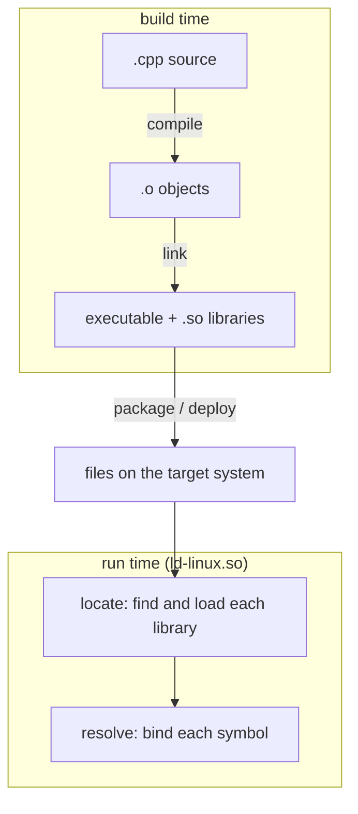

# What is dynamic linking, and how do I troubleshoot it?

The goal is to provide troubleshooting tools for when dynamic linking goes wrong, covering which
tool do you reach for, and what is it actually telling you?

We will not cover the _mechanics_ of dynamic linking (the GOT, PLT, or how to write a shared library
from scratch). Instead we will focus on how to troubleshoot dynamic libraries at different phases of
the dynamic linking process.

# What is dynamic linking?

One of the fundamental aspects of software engineering is code re-use; defining libraries of code
that can be shared, and then combining and composing those building blocks into new libraries and
applications. In general, there are two ways we can **link** a library:

* **Static linking** merges the library into your executable at build time
* **Dynamic linking** resolves library calls at runtime, enabling library re-use without duplicating
  the library for each consumer

This document is about equipping the reader with troubleshooting tools to help them understand
common issues that arise when using dynamic linking.

# The dynamic linking lifecycle

A library passes through several phases on its way from source to a running process. Different
phases have different troubleshooting tools and failure modes, so it's useful to identify what stage
in the lifecycle you're experiencing an issue in.

