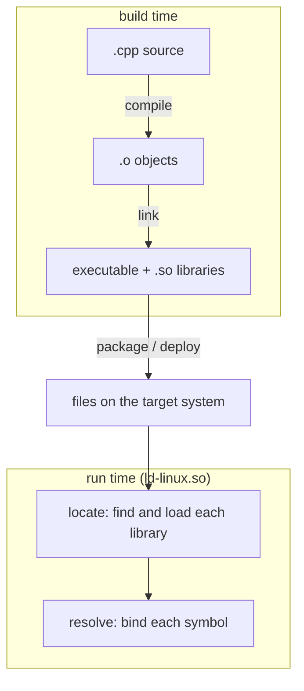
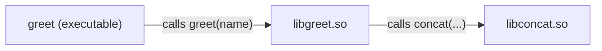

# What is dynamic linking, and how do I troubleshoot it?

The goal is to provide troubleshooting tools for when dynamic linking goes wrong, covering which
tool do you reach for, and what is it actually telling you?

We will not cover the _mechanics_ of dynamic linking (the GOT, PLT, or how to write a shared library
from scratch). Instead we will focus on how to troubleshoot dynamic libraries at different phases of
the dynamic linking process.

# What is dynamic linking?

One of the fundamental aspects of software engineering is code re-use; defining libraries of code
that can be shared, and then combining and composing those building blocks into new libraries and
applications. In general, there are two ways we can **link** a library:

* **Static linking** merges the library into your executable at build time
* **Dynamic linking** resolves library calls at runtime, enabling library re-use without duplicating
  the library for each consumer

This document is about equipping the reader with troubleshooting tools to help them understand
common issues that arise when using dynamic linking.

# The dynamic linking lifecycle

A library passes through several phases on its way from source to a running process. Different
phases have different troubleshooting tools and failure modes, so it's useful to identify what stage
in the lifecycle you're experiencing an issue in.



# Meet the example

Our running example is a three-link chain: an executable that calls a function in one library, which
in turn calls a function in another.



```cpp
// concat.hpp
#pragma once
#include <string>

std::string concat(const std::string& a, const std::string& b);
```

```cpp
// concat.cpp
#include "concat.hpp"

std::string concat(const std::string& a, const std::string& b) {
    return a + b;
}
```

```cpp
// greet.hpp
#pragma once
#include <string>

void greet(const std::string& name);
```

```cpp
// greet.cpp
#include "greet.hpp"
#include "concat.hpp"

#include <iostream>

void greet(const std::string& name) {
    std::cout << concat("hello, ", name) << '\n';
}
```

```cpp
// main.cpp
#include "greet.hpp"

#include <iostream>

int main() {
    std::string name;
    for (;;) {
        std::cout << "> ";
        if (!std::getline(std::cin, name) || name.empty()) {
            break;
        }
        greet(name);
    }
    return 0;
}
```

`main()` loops reading names from stdin; an empty line or EOF exits.

Build the chain bottom-up:

```sh
g++ -fPIC -shared concat.cpp -Wl,-soname,libconcat.so.1 -o libconcat.so.1 && ln -sf libconcat.so.1 libconcat.so
g++ -fPIC -shared greet.cpp  -L. -lconcat -Wl,-soname,libgreet.so.1 -o libgreet.so.1 && ln -sf libgreet.so.1 libgreet.so
g++ main.cpp -L. -lgreet -Wl,-rpath-link,. -o greet
```

`-rpath-link` lets the linker resolve a dependency's own dependencies (`libgreet` needs `libconcat`)
at link time, without recording anything in the binary. The C++ sources also pull in the C++ runtime
(`libstdc++`, `libgcc_s`).

The libraries are not installed system-wide, so we point the loader at the build directory to run:

```sh
$ LD_LIBRARY_PATH=. ./greet
> world
hello, world
> Bob
hello, Bob
>
$
```

# Relocatable and position-independent code

Compile one source file and you get a **relocatable object** (`.o`); link objects together and you
get an executable or a **shared object** (`.so`). `readelf -h` reports which kind a file is:

```sh
$ g++ -fPIC -c concat.cpp -o concat.o
$ readelf -h concat.o | grep Type
  Type:                              REL (Relocatable file)
$ readelf -h libconcat.so.1 | grep Type
  Type:                              DYN (Shared object file)
```

**Relocatable** means the addresses are not decided yet. `greet.cpp` refers to the `"hello, "`
string literal, but the compiler does not know where that literal will live, so instead of an
address it leaves a blank and records a *relocation* telling the linker to patch the real address in
later. `readelf -r` lists those blanks:

```sh
$ g++ -fPIC -c greet.cpp -o greet.o
$ readelf -r greet.o | grep rodata
00000000001e  000900000002 R_X86_64_PC32     0000000000000000 .rodata - 4
000000000044  000900000002 R_X86_64_PC32     0000000000000000 .rodata + 4
000000000035  000900000002 R_X86_64_PC32     0000000000000000 .rodata + 36
```

Each row is one blank. Linking is, in large part, assigning final addresses and filling them in.

**Position-independent** means the code runs correctly no matter what address it is loaded at. The
relocation *type* is where you see it. `R_X86_64_PC32` above is PC-relative: the literal is reached
as an offset from the current instruction, so the same bytes work wherever the library lands.
Compile without `-fPIC` and the compiler emits absolute addresses instead (`R_X86_64_32`):

```sh
$ g++ -fno-pic -fno-pie -c greet.cpp -o greet.o
$ readelf -r greet.o | grep rodata
000000000020  00090000000a R_X86_64_32       0000000000000000 .rodata + 0
000000000042  00090000000a R_X86_64_32       0000000000000000 .rodata + 8
000000000033  00090000000a R_X86_64_32       0000000000000000 .rodata + 3a
```

A shared library is mapped at a different address on every run (this is what ASLR does), so a
hardcoded absolute address would be wrong. A `.so` must therefore be position-independent; build one
from non-PIC objects and the linker refuses:

```sh
$ g++ -shared greet.o -o libgreet.so.1
/usr/bin/ld.bfd: greet.o: relocation R_X86_64_32 against `.rodata' can not be used when making a shared object; recompile with -fPIC
```
