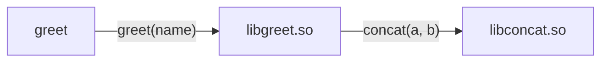

# How does dynamic linking work?

In general, there are two kinds of libraries that applications can depend on to facilitate code
reuse:

* **Static libraries** are bundled into the program at build time, and the resulting executable
  contains all of the code it needs to run.
* **Dynamic libraries** are not bundled into the program at build time. Instead the executable
  contains references to the libraries that are resolved at runtime. This allows sharing a single
  library across multiple programs, and it allows updating the library without rebuilding the
  programs that depend on it (so long as the new library is compatible with the old one).

This document will attempt to provide a ground-up understanding of how dynamic linking works, with a
focus on common troubleshooting tools and failure scenarios. The exact details of how dynamic
linking works varies between operating systems (this document is Linux-specific) but the general
principles apply equally across all platforms.

# An example application

Our example is a chain of dynamic function calls:



Both `libgreet.so` and `libconcat.so` will be implemented by a single header+source file translation
unit.

```cpp
// concat.hpp
#pragma once
#include <string>

std::string concat(const std::string& a, const std::string& b);
```

```cpp
// concat.cpp
#include "concat.hpp"

std::string concat(const std::string& a, const std::string& b) {
    return a + b;
}
```

```cpp
// greet.hpp
#pragma once
#include <string>

void greet(const std::string& name);
```

```cpp
// greet.cpp
#include "greet.hpp"
#include "concat.hpp"

#include <iostream>

void greet(const std::string& name) {
    std::cout << concat("hello, ", name) << '\n';
}
```

And then the `greet` executable will prompt for input and call through to the dynamic `greet()`
function:

```cpp
// main.cpp
#include "greet.hpp"

#include <iostream>

int main() {
    std::string name;
    while (std::cout << "> " && std::getline(std::cin, name) && !name.empty()) {
        greet(name);
    }
}
```

But building `libconcat.so` the obvious way fails:

```sh
$ g++ -shared concat.cpp -o libconcat.so
/usr/bin/ld.bfd: /tmp/ccCIUL4s.o: relocation R_X86_64_32 against `.rodata' can not be used when making a shared object; recompile with -fPIC
/usr/bin/ld.bfd: failed to set dynamic section sizes: bad value
collect2: error: ld returned 1 exit status
```

This error presumably has something to do with a **relocation**. What is that all about?

## Relocations

Compile one source file on its own and you get a _relocatable object_ (`.o`):

```sh
$ g++ -c concat.cpp -o concat.o
$ readelf -h concat.o | grep Type:
  Type:                              REL (Relocatable file)
```

A **relocatable object** is one that has placeholders for addresses that are not yet known. The
`concat(a, b)` function is an example of this: it refers to `std::operator+()` to concatenate two
strings, but `std::operator+()` is defined in `libstdc++`, not in `concat.cpp`, so the compiler
cannot resolve it immediately.

Instead, it leaves a **relocation** placeholder:

```sh
$ readelf --wide -r concat.o
Relocation section '.rela.text' at offset 0x2a10 contains 1 entry:
    Offset             Info             Type               Symbol's Value  Symbol's Name + Addend
0000000000000027  0000003a00000004 R_X86_64_PLT32         0000000000000000 _ZStplIcSt11char_traitsIcESaIcEENSt7__cxx1112basic_stringIT_T0_T1_EERKS8_SA_ - 4
```

That's gibberish. Add `-C` to demangle the symbol name:

```sh
$ readelf --wide -rC concat.o
Relocation section '.rela.text' at offset 0x2a10 contains 1 entry:
    Offset             Info             Type               Symbol's Value  Symbol's Name + Addend
0000000000000027  0000003a00000004 R_X86_64_PLT32         0000000000000000 std::__cxx11::basic_string<char, std::char_traits<char>, std::allocator<char> > std::operator+<char, std::char_traits<char>, std::allocator<char> >(...) - 4
```

So at offset `0x27` in `.text` there's a reference to `std::operator+` that the linker must resolve.

## Position-independent code

So that explains what a relocation _is_, but it doesn't explain why relocations can cause problems
producing a shared library. The original error message mentioned `R_X86_64_32` and `.rodata`, so
let's take a closer look:

```sh
$ readelf -r concat.o | grep rodata
0000000000000033  000000220000000a R_X86_64_32            0000000000000000 .rodata + 0
```

The `R_X86_64_32` relocation type is an **absolute** address.

If we compile with `-fPIC` as the error message suggested, we get a different relocation type:

```sh
$ g++ -fPIC -c concat.cpp -o concat.o
$ readelf -r concat.o | grep rodata
0000000000000035  0000002200000002 R_X86_64_PC32          0000000000000000 .rodata - 4
```

The `R_X86_64_PC32` relocation type is an address that's **relative** to the program counter
(abbreviated "PC" - it's the address of the current instruction). This is what **position
independent** code is: code that can be loaded at any address.

This is important, because Linux uses **Address Space Layout Randomization** (ASLR) to load programs
and libraries at random addresses as a security mitigation. So we need to compile with `-fPIC` to
ensure that when we refer to a relocation, we do so in a way that's _relative_ to a known address.

```sh
$ g++ -fPIC -shared concat.cpp -o libconcat.so
$ readelf -h libconcat.so | grep Type:
  Type:                              DYN (Shared object file)
```

With `-fPIC`, the libraries and executable build:

```sh
$ g++ -fPIC -shared concat.cpp -o libconcat.so
$ g++ -fPIC -shared greet.cpp -L. -lconcat -o libgreet.so
$ g++ main.cpp -L. -lgreet -lconcat -o greet
```

# Starting the program

If we try to run `./greet`, we get yet another error:

```sh
$ ./greet
./greet: error while loading shared libraries: libgreet.so: cannot open shared object file: No such file or directory
```

So we can see that the `greet` executable is _trying_ to load the `libgreet.so` shared library, but
it can't find it. Before we can understand why, we need to know how the executable is attempting to
load dynamic dependencies.

We can use `strace` to watch `greet` attempt to look for `libgreet.so`:

```sh
$ strace -e open,openat ./greet
openat(AT_FDCWD, "/etc/ld.so.cache", O_RDONLY|O_CLOEXEC) = 3
openat(AT_FDCWD, "/lib64/glibc-hwcaps/x86-64-v4/libgreet.so", O_RDONLY|O_CLOEXEC) = -1 ENOENT (No such file or directory)
openat(AT_FDCWD, "/lib64/glibc-hwcaps/x86-64-v3/libgreet.so", O_RDONLY|O_CLOEXEC) = -1 ENOENT (No such file or directory)
openat(AT_FDCWD, "/lib64/glibc-hwcaps/x86-64-v2/libgreet.so", O_RDONLY|O_CLOEXEC) = -1 ENOENT (No such file or directory)
openat(AT_FDCWD, "/lib64/libgreet.so", O_RDONLY|O_CLOEXEC) = -1 ENOENT (No such file or directory)
openat(AT_FDCWD, "/usr/lib64/glibc-hwcaps/x86-64-v4/libgreet.so", O_RDONLY|O_CLOEXEC) = -1 ENOENT (No such file or directory)
openat(AT_FDCWD, "/usr/lib64/glibc-hwcaps/x86-64-v3/libgreet.so", O_RDONLY|O_CLOEXEC) = -1 ENOENT (No such file or directory)
openat(AT_FDCWD, "/usr/lib64/glibc-hwcaps/x86-64-v2/libgreet.so", O_RDONLY|O_CLOEXEC) = -1 ENOENT (No such file or directory)
openat(AT_FDCWD, "/usr/lib64/libgreet.so", O_RDONLY|O_CLOEXEC) = -1 ENOENT (No such file or directory)
./greet: error while loading shared libraries: libgreet.so: cannot open shared object file: No such file or directory
+++ exited with 127 +++
```

Now, our `main()` function in `main.cpp` didn't have _any_ kind of code to do this loading, so how
is it happening?

On Linux, with ELF binaries, this is done by the **program interpreter** a.k.a. "dynamic
interpreter" a.k.a. "dynamic loader" a.k.a. "dynamic linker". The path to the dynamic linker is
hard-coded in every ELF executable, and it cannot be overridden. We can use `readelf` to see what it
is:

```sh
$ readelf -p .interp greet
String dump of section '.interp':
  [     0]  /lib64/ld-linux-x86-64.so.2
```

We can refer to the [ld.so(8)](https://man7.org/linux/man-pages/man8/ld.so.8.html) man page for tons
more information on what `ld.so` is, and how we can customize its behavior.

When we run `./greet`, the first thing the Linux kernel does is read the `PT_INTERP` program header
to find the dynamic interpreter, and then it uses that dynamic interpreter to load the executable
and all of its dependencies. So the code that gets executed first when we run `./greet` is actually
`ld-linux-x86-64.so.2`, not `main()`.

# Finding the libraries

The first thing that `ld-linux.so` does when it loads an executable is to look at the `DT_NEEDED`
entries in the executable's dynamic section to find out what shared libraries it needs to load. We
can use `readelf` to see these entries ourselves:

```sh
$ readelf --dynamic greet | grep NEEDED
 0x0000000000000001 (NEEDED)             Shared library: [libgreet.so]
 0x0000000000000001 (NEEDED)             Shared library: [libconcat.so]
 0x0000000000000001 (NEEDED)             Shared library: [libstdc++.so.6]
 0x0000000000000001 (NEEDED)             Shared library: [libm.so.6]
 0x0000000000000001 (NEEDED)             Shared library: [libgcc_s.so.1]
 0x0000000000000001 (NEEDED)             Shared library: [libc.so.6]
```

## Library search order

After learning what DSOs it needs to load, the dynamic linker searches for them with in a specific order:

1. `DT_RPATH` specified in the executable
2. `LD_LIBRARY_PATH` environment variable
3. `DT_RUNPATH` specified in the executable
4. `ld.so.cache` cache managed by `ldconfig`
5. Default search paths

The `LD_LIBRARY_PATH` environment variable is often the easiest way to get a library loaded, but
it's intended to allow users the ability to override library lookup, so if an application depends on
it, that can be fragile.

We can use it to get the `greet` executable to find `libgreet.so` and `libconcat.so`:

```sh
$ LD_LIBRARY_PATH=. ./greet
> bob
hello, bob
```

## Debugging library search failures

## RPATH and RUNPATH

## ld.so.cache and ldconfig

# Relocations and the GOT

# Making a dynamic function call

## The PLT and lazy binding

## LD_BIND_NOW

# Resolving symbols

## .dynsym dynamic symbol table

## Symbol visibility

## Symbol versioning

# More resources
